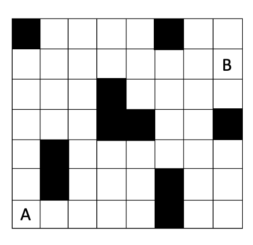

# Finding shortest path
Remember the origin of the map starts from the upper left corner. The code is set for finding an optimal path in the following map, but one can change the map configurations in int main() function.

# 8 puzzle game
Two heuristics are used to solve the puzzle - 
1. Number of misplaced tiles and
2. Manhattan distance of each block to the final place of the block in the puzzle.

